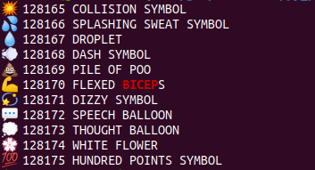

# py_print_unicodes
print most unicode characters and names

Send the output to a file for inspection with:

```
$ python3 print_valid_unicodes.py > out.txt

$ wc -l out.txt 
41898 out.txt

$ grep -C 5 'BICEP' out.txt 
💥 128165 COLLISION SYMBOL
💦 128166 SPLASHING SWEAT SYMBOL
💧 128167 DROPLET
💨 128168 DASH SYMBOL
💩 128169 PILE OF POO
💪 128170 FLEXED BICEPS
💫 128171 DIZZY SYMBOL
💬 128172 SPEECH BALLOON
💭 128173 THOUGHT BALLOON
💮 128174 WHITE FLOWER
💯 128175 HUNDRED POINTS SYMBOL
```


Output will look something like this:


